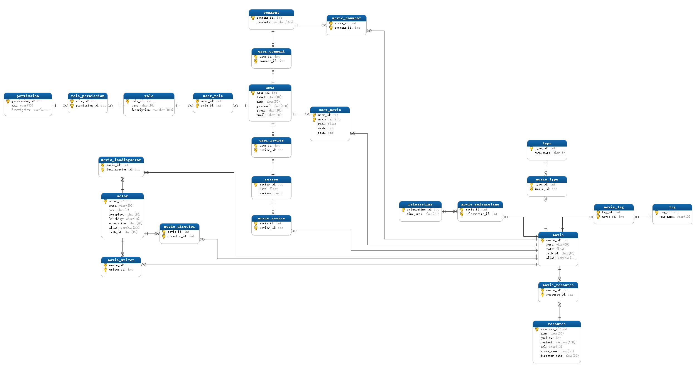
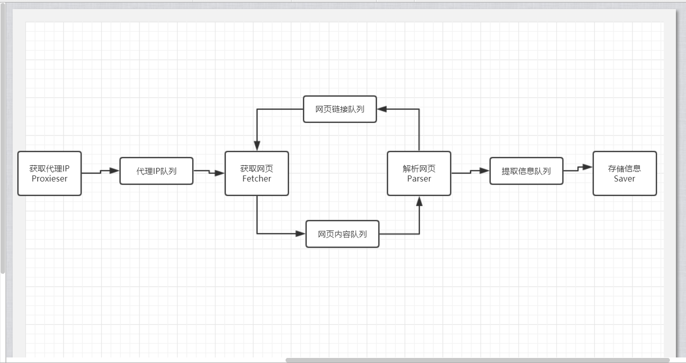
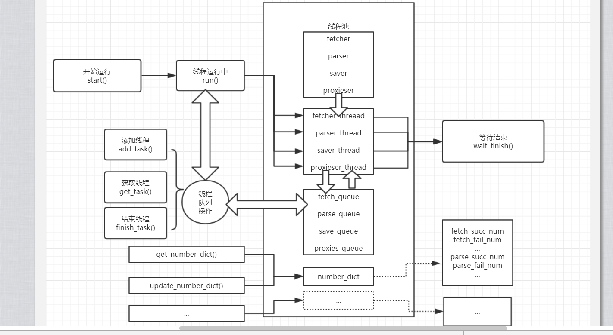
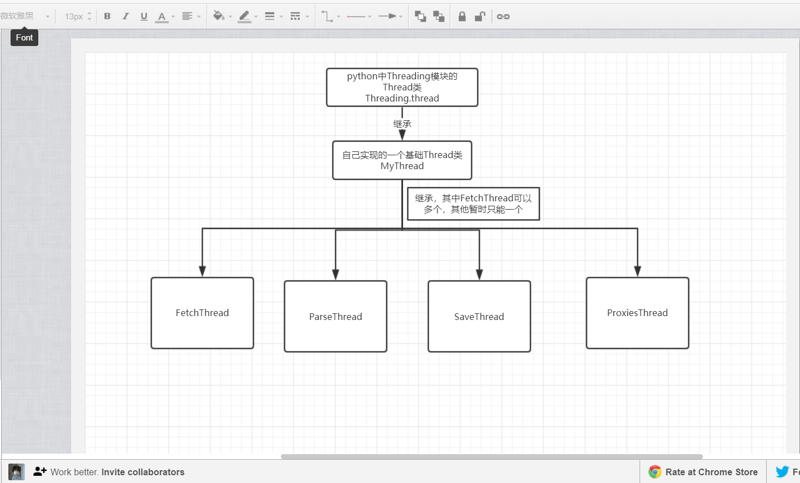
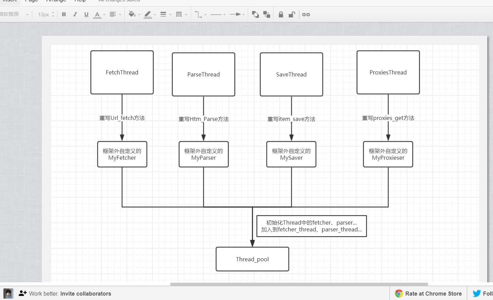

## [施工]代码重构中...

# 安装方法

# 使用方式

# 数据库ER关系图

# 框架整体流程图

# 线程池原理图

# 线程池初始化原理图

# 使用接口示意图

**友情链接**：

- [IPProxyTool](https://github.com/awolfly9/IPProxyTool)
- [PSpider](https://github.com/xianhu/PSpider)

**标注**：此项目所用spider借鉴自[PSpider](https://github.com/xianhu/PSpider)，代码重构与修改保留LICENSE，符合BSD2开源协议